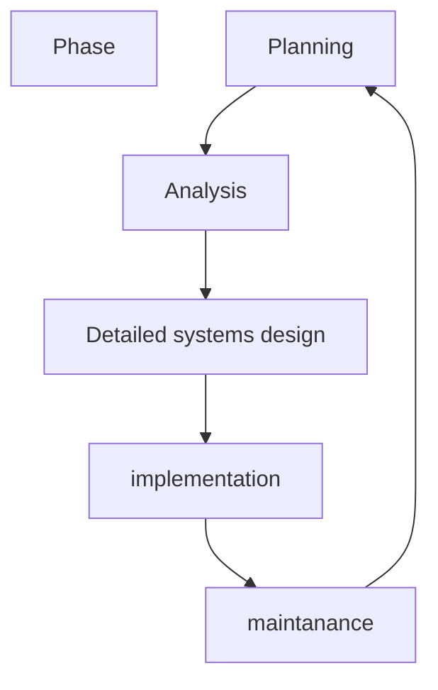
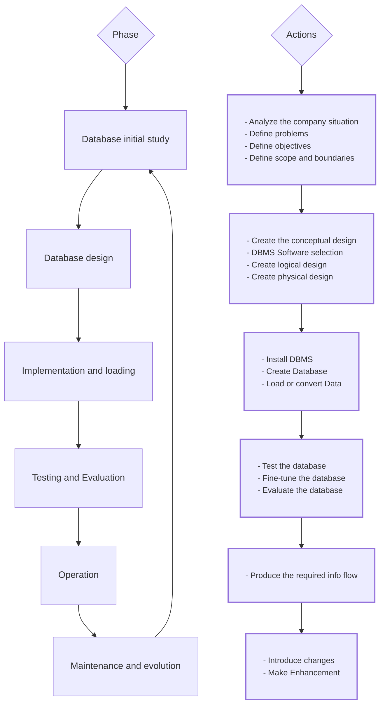
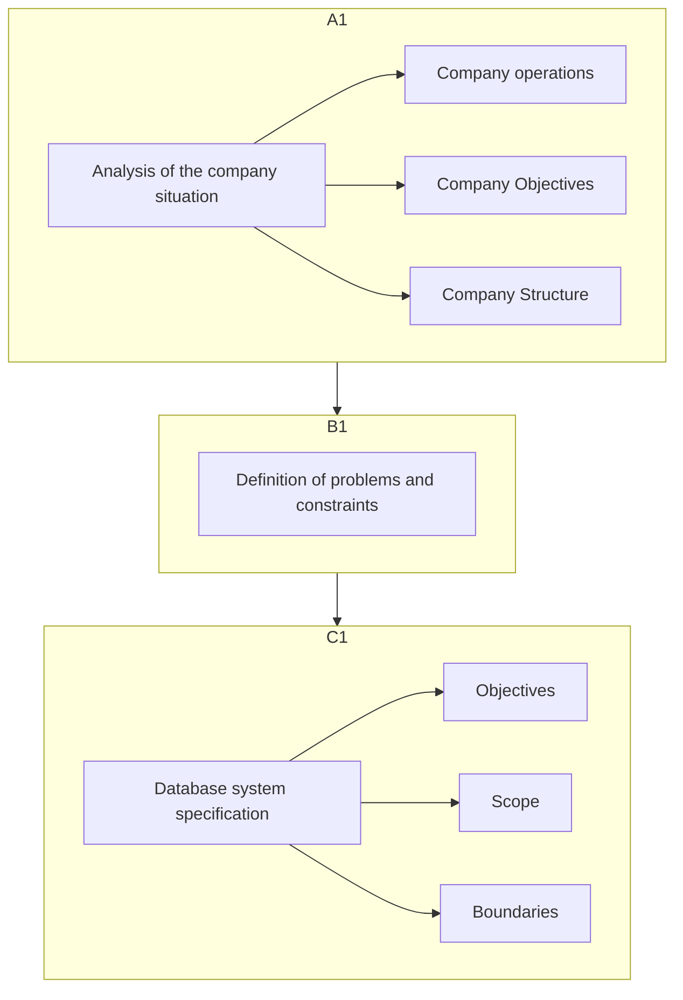
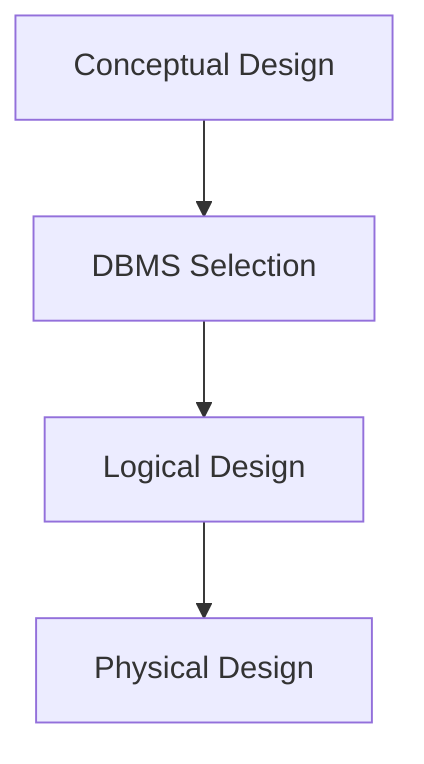
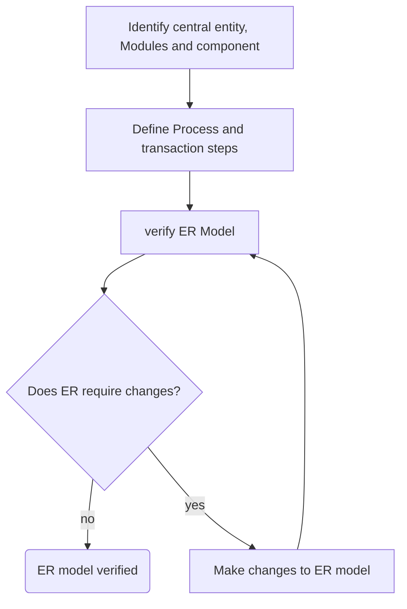

## Learning Objectives

 
<ul><li> Provides for data collection, storage and retrieval</li></ul>
<ul>
	 <li> Composed of:
	 <ul>
	 <li>People, hardware, software
	<li> Database, application programs, procedures
	 </ul>
</ul>
<ul> 
<li> <b>Systems Analysis:</b> process that establishes need for and extend of information systems
</ul>

<ul> 
<li><b>Systems development:</b> Process of creating information system
</ul>

## Performance factors of an information systems

 

	
 
		Database design and implementation
	

	

		Application design and implementation
	

		

		Administrative procedures
	

		

		<b>Database Development:</b> Process of database design and its implementation
	

	

## Systems Development Life Cycle

 
	
Traces history of an information system

	
Provides a picture within which development are mapped out  

	
Iterative rather than sequential process 

**Planning :** 
- Initial Assessment
- Feasibility study

**Analysis:**
- User Requirement
- Logical system design

**Detailed systems design:**
- Detailed systems specification

**Implementation:**
- Coding, testing, debugging
- installation, fine-tuning

**Maintenance:**
- Evaluation
- Maintenance
- Enhancement

## Database Life Cycle

### Purpose of Database initial study

- To analyze company situation
- define problems and constraint
- define objectives
- define scope and boundaries

### Summary of Activities in the database initial study

## Database Design

 
<ul style="Background-color: pink; display: inline-block; border-radius: 10px; color: black; padding: 20px; margin-left: 15px;"> Support Company's operations and objectives</ul>
<ul style="Background-color: purple; display: inline-block; border-radius: 10px; color: white; padding: 20px; margin-left: 15px;">
	 Pointers for examining completion procedures
	 <ul>
	 <li>Data Component is an element of whole system
	<li> Database design is an iterative process
	 </ul>
</ul>
<ul style="Background-color: blue; display: inline-block; border-radius: 10px; color: white; padding: 20px; margin-left: 15px;">
Checks the ultimate final product from all perspectives
</ul>

**Database Design Process**

1. Conceptual Design
	- Data analysis and requirement
	- ERD modelling
2. Select the DBMS
3. Logical Design
	- Map conceptual model to logical model components
	- Normalization
	- Integrity constraint
	- Validate against user requirement
4. Physical Design
	- Define data storage organisation
	- Define security and integrity
	- Define performance measures

## Implementation and Loading

1. Install the DBMS
	- Virtualization
2. Create the Database
	- Requires the creation of the storage-related constructs
3. Load or Convert Data
	- aggregating data from multiple resources

## Testing Factors

What to test in Database?
- physical security
- Password Security
- Access Rights
- Audits Trails
- Data Encryption
- Diskless Workstations
- Optimization

### Levels of database Backups
- Full Backup:
	- All database object are backed up in their entirety
- Differential Backup:
	- Only modified/updated object since last full backup
- Transaction log backup
	- Only the Transactions log operation that are not reflected in previous backup are backed up

### Sources of Database failure

  <ul>
    <li style="background-color: #3b3b3b; color: #cfcfcf; padding: 5px; border-radius: 5px; margin-bottom: 5px; border: 1px solid #555;">Software</li>
    <li style="background-color: #3b3b3b; color: #cfcfcf; padding: 5px; border-radius: 5px; margin-bottom: 5px; border: 1px solid #555;">Hardware</li>
    <li style="background-color: #3b3b3b; color: #cfcfcf; padding: 5px; border-radius: 5px; margin-bottom: 5px; border: 1px solid #555;">Programming exemptions</li>
    <li style="background-color: #3b3b3b; color: #cfcfcf; padding: 5px; border-radius: 5px; margin-bottom: 5px; border: 1px solid #555;">Transactions</li>
    <li style="background-color: #3b3b3b; color: #cfcfcf; padding: 5px; border-radius: 5px; margin-bottom: 5px; border: 1px solid #555;">External factors</li>
  </ul>

## Periodic Maintenance Activities

- Preventive Maintenance (Backup)
- Corrective Maintenance (Recovery)
- Adaptive Maintenance
- Assignment of permissions 
- Periodic security Audits
- Periodic system-usage summaries

## Conceptual design

- Designs a database without the database software or any physical details
- Conceptual data model - ERD, entity, attributes
- Minimum Data rule: only list what is there needed, and what needed is there

## Conceptual Designs Steps

1. Data analysis and requirement gathering
2. ERD modelling and Normalization
3. Data model verification
4. Distribute the design

## Iterative ER Model Verification process

 

## Cohesivity and module coupling

 

<li style="margin-bottom: 10px;"><b>Cohesivity:</b> Strength of the relationships among the module's entities
<li> <b>Module Coupling:</b> Extent to which modules are independent to one another

 

## Factors Affecting Software Purchasing Decision

 

<li> Cost
<li> DBMS features and tools
<li> Underlying model
<li> Portability
<li> DBMS hardware requirements

