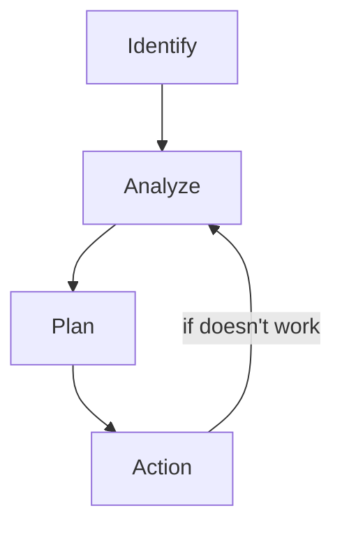
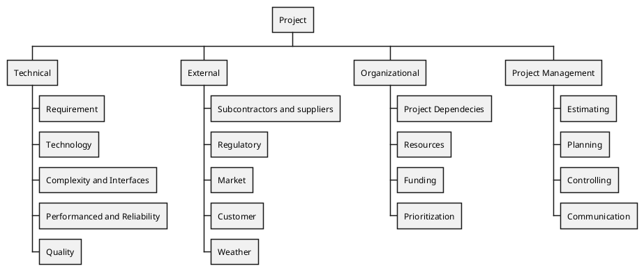

<h1>Risk Management</h1>

<h2>Risk Breakdown structure</h2>

---

<h2>Partial Risk Profile</h2>
Technical
- Is enough expertise?
Design
- Does design good?
Development
- Is the process supported by compatible set of procedures?

Asking these types of question to find potential risk.

---
<h2>Risk Assessment Form</h2>
