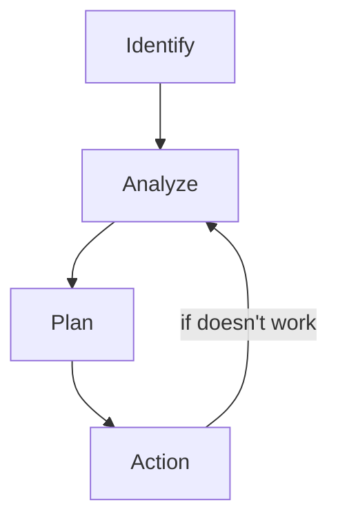
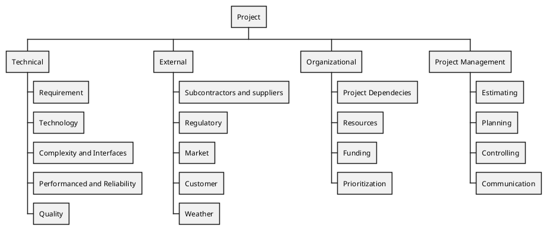

<h1>Risk Management</h1>

<h2>Risk Breakdown structure</h2>

---

<h2>Partial Risk Profile</h2>

Technical
- Is enough expertise?
Design
- Does design good?
Development
- Is the process supported by compatible set of procedures?

Asking these types of question to find potential risk.

---
<h2>Risk Assessment Form</h2>
Assess the risk
- The likelihood
- Impact if it happened

---
<h2>Risk Response Development</h2>

**Managing Risk:**
- Mitigate Risk
- Avoid Risk
- Transferring Risk
- Retaining Risk

**Contingency Planning**
- Alternative plan
- If Dont have
	- Slow managerial response
	- Decisions under pressure potential dangerous and costly

**Technical Risk**
- Backup if technologies fail

Scheduling Risks
- Use slack risk of late project finish-compress
- Imposed Duration date
- lambat siap

**Cost Risks**
- Time/Costs dependency Links
- Price protection risks

**Funding Risks**
- What if funding were cut suddenly
- Changes in supply demands

<h2>Opportunity Management Tactics</h2>

**Exploit**
- Seeking To eliminate the uncertainty

**Share**
- Allocate some or all the ownership of an opportunity to another party

**Enhance**
- Increase probability or impact

**Accept**
- Being willing to take advantage of an opportunity

<h2>Managing Risk</h2>

**Risk Response Control**

Risk Control
- Execution of Risk Response
Establishing a change management system
- Monitor, tracking, reporting risk

<h2>Key Terms</h2>

**Chat GPT**

- **Avoiding Risk**: Choosing not to do something in the project to eliminate the chance of problems. It's like not taking a shortcut to avoid getting lost.

- **Budget Reserve**: Extra money set aside to handle unexpected expenses during the project. It’s like keeping emergency money in your wallet.

- **Change Management System**: A process to handle changes in the project, making sure they are approved and tracked. It's like updating a recipe when you decide to add new ingredients.

- **Contingency Plan**: A backup plan in case something goes wrong. It’s like bringing an umbrella just in case it rains.

- **Management Reserve**: Extra budget or time set aside for unexpected, big changes in the project. It's like having a hidden stash of emergency supplies.

- **Mitigating Risk**: Taking steps to reduce the impact or likelihood of a problem. It’s like putting on a helmet when riding a bike to reduce injury risk.

- **Opportunity**: A positive risk that could benefit the project if it happens. It’s like finding a shortcut that saves time.

- **Retaining Risk**: Choosing to accept a risk and deal with it if it happens. It’s like deciding not to wear a jacket even if it might get chilly.

- **Risk**: Anything that might affect the project, either positively or negatively. It's like weather on a picnic day—could be sunny or stormy.

- **Risk Breakdown Structure (RBS)**: A chart that organizes and categorizes risks in a project. It's like sorting your toys into different boxes.

- **Risk Profile**: A description of the types of risks a project might face and how they are viewed by the organization. It's like knowing what kind of weather is common in your area.

- **Risk Register**: A list of all the risks in the project, including their details and how you plan to handle them. It's like a checklist of what could go wrong and how to fix it.

- **Risk Severity Matrix**: A grid that shows how serious a risk is based on its likelihood and impact. It’s like a traffic light—green for safe, red for danger.

- **Scenario Analysis**: A method of imagining different situations to see how the project might be affected. It’s like thinking about what you’ll do if it rains during your picnic.

- **Time Buffer**: Extra time added to the schedule to handle delays. It’s like leaving early to catch a bus in case there’s traffic.

- **Transferring Risk**: Shifting the risk to someone else, like buying insurance. It’s like asking a friend to help you if something goes wrong.
---
**DeepSeek**

- **Risk**: Something that might happen and could mess up your project.  
  *Example*: Rain ruining your picnic.

- **Avoiding Risk**: Changing your plans so the bad thing won’t happen.  
  *Example*: Moving your picnic indoors so the rain won’t ruin it.

- **Budget Reserve**: Extra money saved just in case something goes wrong.  
  *Example*: Having extra cookies in case you drop some.

- **Change Management System**: A way to handle changes in your project.  
  *Example*: Deciding if you can add more games to your party.

- **Contingency Plan**: A backup plan if something goes wrong.  
  *Example*: Having umbrellas ready if it rains.

- **Management Reserve**: Extra money and time saved for big surprises.  
  *Example*: A secret stash of candy for emergencies.

- **Mitigating Risk**: Making the bad thing less likely or less bad.  
  *Example*: Wearing a helmet so you don’t get hurt if you fall.

- **Opportunity**: A chance for something good to happen.  
  *Example*: Finding extra toys at the park.

- **Retaining Risk**: Deciding to just deal with the risk if it happens.  
  *Example*: Knowing you might get wet if you play in the rain.

- **Risk Breakdown Structure (RBS)**: A list of all the things that could go wrong, sorted into groups.  
  *Example*: A list of "weather problems," "toy problems," etc.

- **Risk Profile**: A picture of all the risks your project has.  
  *Example*: A drawing of all the things that could go wrong.

- **Risk Register**: A notebook where you write down all the risks and what you’ll do about them.  
  *Example*: A list of "bad things" and your plans.

- **Risk Severity Matrix**: A chart that shows how bad each risk is.  
  *Example*: A traffic light: red = really bad, yellow = kinda bad, green = not so bad.

- **Scenario Analysis**: Thinking about what might happen in different situations.  
  *Example*: Imagining what you’d do if it rained, snowed, or was sunny.

- **Time Buffer**: Extra time added to your plan in case things take longer.  
  *Example*: Giving yourself more time to clean up in case you spill something.

- **Transferring Risk**: Letting someone else handle the risk.  
  *Example*: Asking your friend to bring the cake so you don’t have to worry about dropping it.