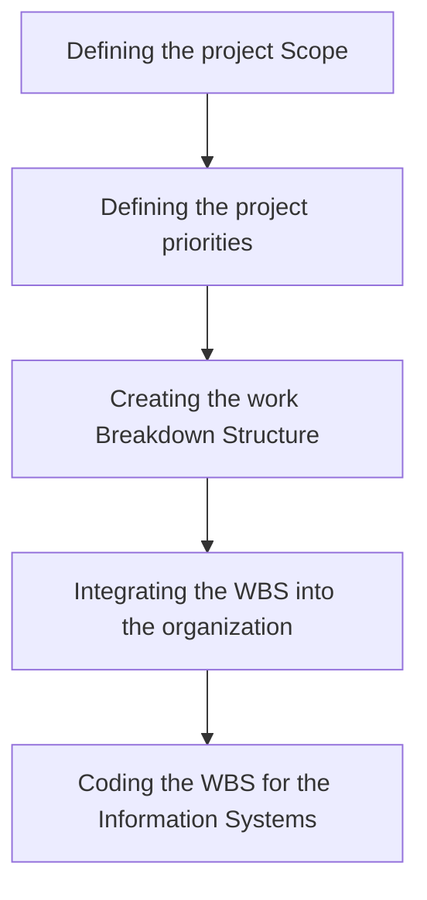
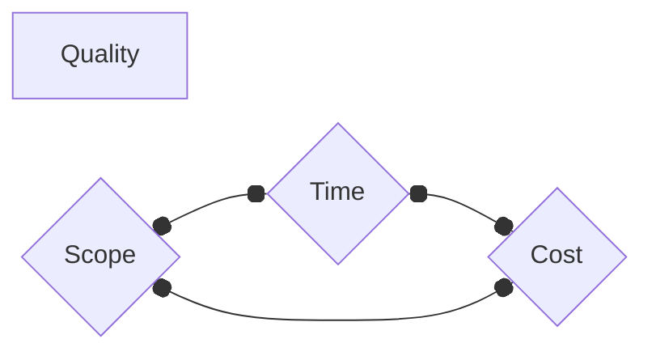
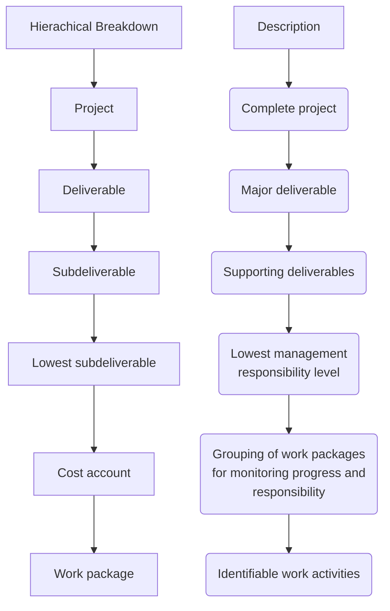

## Defining the project

### Learning Objectives

Elaborate the purpose and importance of project management from the perspective if planning, tracking and completion of project

### Defining the project

Defining the project scope

### Step 1: Defining the project scope

**Project Scope**
- A definition of the end result of the project
- plan/service/product in a specific and measurable terms

**Purpose of the Scope Statement**
- To clearly define the deliverables for the client/end user
- Measuring project success
- To be use in planning

**Project Scope Checklist**
1. Project objectives
2. Deliverables
3. Milestone
4. Technical requirements
5. Limits and exclusions
6. Reviews with customer

**Terms and Definitions**

Scope Statements
- Also called statements of work

Project Charter
- contain expanded ver of scope statement
- Document authorizing the project manager to initiate the project

Scope Creep
- Tendency for the project to expand due to change in:
	- Requirements
	- specific
	- priorities

### Step 2: Establishing Project Priorities

**Causes of project Trade-Offs**
- shifts in the relative importance of criterions 

**Managing the priorities of project trade-offs**
- **Constrain** : a parameter is a fixed requirement (x leh ubah)
- **Enhance** : optimizing a criterion over others (pentingkan)
- **Accept** : reducing a criterion requirement (Ubah ikot kesesuaian)

**Project management trade-offs**

- can only trade one at a time, if trade too much can reduce the quality of the project

### Step 3: Creating the Work Breakdown Structure

**Work Breakdown Structure**
- A hierarchical outline that identifies products and work in a project
- Defines the relationship between work and deliverables

**How WBS Helps the project Manager**

- Facilitates evaluation cost, times, and technical performance
- Breakdown work based on hierachy
- Helps manage plan, schedule and budget

Example:
![[Pasted image 20250120114656.png]]

**Work Packages**

lowest level of WBS
- output oriented
	1. Defines work
	2. identifies time to complete
	3. identifies cost
	4. identifies resource needed
	5. identifies person responsible
	6. identifies monitoring point

### Step 4: Integrating the WBS with the Origanisation

Depicts how the firm is organized to discharge its work responsibility for project

![[Pasted image 20250120115740.png]]
- notes: idk dahel is dis

### Step 5: Coding the WBS for the Information System

