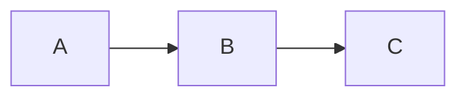
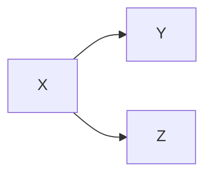
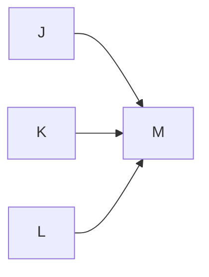
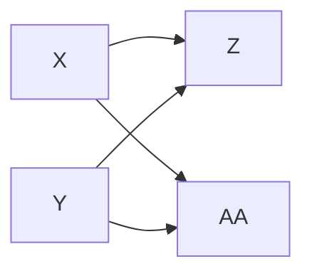
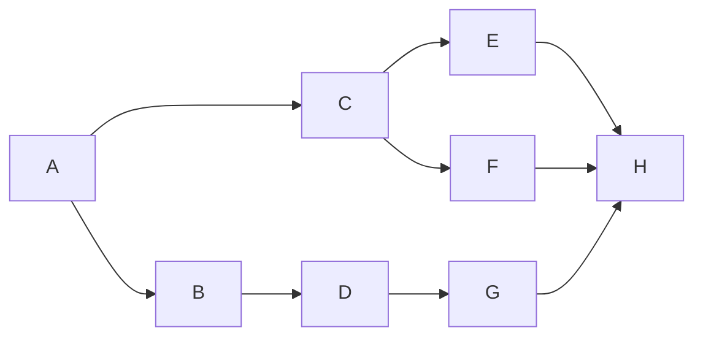

## Developing a project plan

### Learning Objective

Elaborate the purpose and importance of project management from the perspective of planning, tracking and completion of project

### Developing the Project Plan

**The project Network**

- A flow chart that graphically depicts the sequence, interdependencies and start and finish times of a project plan
	- provide the basis for scheduling labor and equipment
	- enchance communication
	- provide an estimates project duration
	- provide budget
	- identifies activity that are critical
	- help teams stay on plan

### Introduction to Agile methodology

Scrum:

Sprints define it, and it advocates maximizing application development time and achieving the product goals

Kanban:

This method splits a ‘Kanban board’ (board or table) into columns. Each flow within the project is shown in columns as a ‘card’,
and the information changes as developments move ahead. A new card is added whenever a new task is introduced.

### Constructing a Project Network

**Terminology:**
- Activity : An element of the project that requires times
- Merge Activity: Activity that has 2 or more preceding event
- Parallel Activities: Activities that can occur independently and if desired not at the same time
- Path: A sequence of connected dependent activities
- Critical Path: 
	- The Longest Path through the activity network that allows for the completion of all project-related activities.
	- The shortest expected time in which project to be completed
	- Delays on the critical path will cause delay on the entire project
- Event: A point in time when an activity is started or completed
- Burst Activity: an activity that has more than one activity immediately following it (branching into multiple activity)

**Two Approaches**
- Activity on Node
- Activity on Arrow

### Activity-On-Node Fundamentals

-A is preceded by nothing
-B is preceded by A
-C is preceded by B

---

- Y and Z are preceded by X
- Y and Z can begin at the same time, if you wish
- X is a burst activity

---

- J,K & L can all begin at the same time, 
- but, all J, K , L must complete before M start
- M is a merge activity
---

- Z is preceded by X and Y
- AA is preceded by X and Y

--- 

lets try examples:
![[Pasted image 20250120140202.png]]

- gg ez

---
example of Network Diagram

![[Untitled Diagram 2.svg]]
**Legend:**
- ES - early start
- ID - process ID
- EF - Early Finish
- SL - Successor
- LS - Late Start
- DUR - Duration
- LF - Late Finish

### Determining Free Slack or Float

<h2 style="border: 3px solid blue;  border-radius: 15px;
	padding: 5px 10px;
	margin-bottom: 0px;"> FS - Free Slack </h2>
 
	<li>
	The amount of time an activity can be delayed
	</li> 
	<li> 
	How long an activity can exceed it finish date without affecting start date of next activity
	</li>

<h2 style="border: 3px solid red;  border-radius: 15px;
	padding: 5px 10px;
	margin-bottom: 0px;"> TS - Total Slack </h2>
 
	<li>
	Total slack is the amount of time a task can be delayed before the project finish is delayed
	</li> 

<h2 style="border: 3px solid green;  border-radius: 15px;
	padding: 5px 10px;
	margin-bottom: 0px;"> Sensitivity</h2>
 
	<li>
	The likelihood the original critical path will change once the project is initiated
	</li> 

