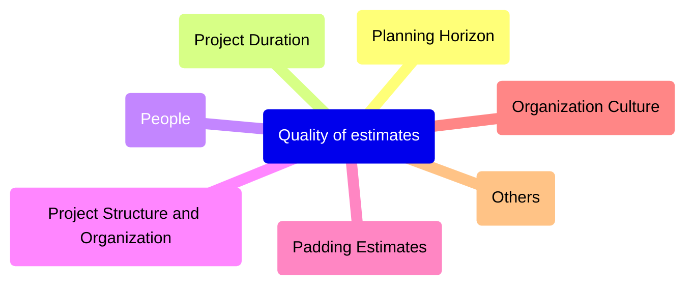
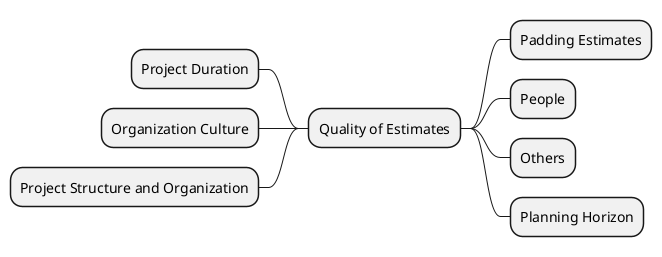
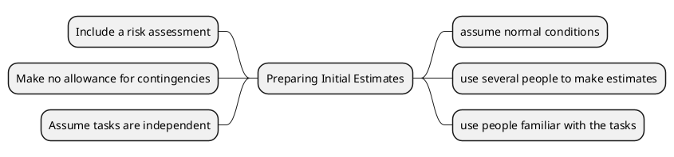

<h1>Estimating Project Time and Cost</h1>
<h2>Learning objectives</h2>
- Identify appropriate techniques to estimate project time and costs

<h2>Why Important</h2>
- To support good decisions 
- to schedule work
- to determine project duration
- Develop cash flow needs

<h2>Factors Influencing the Quality of Estimates</h2>

<h2>Developing Work Package Estimates</h2>

