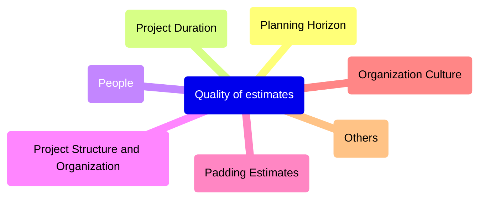
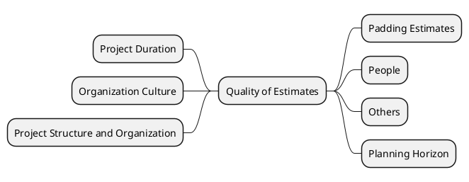
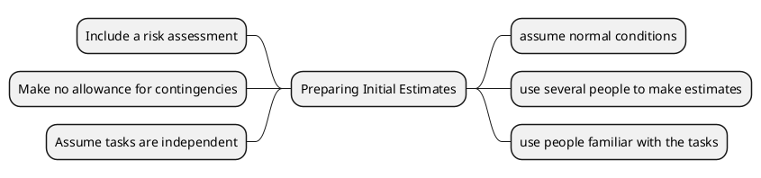

<h1>Estimating Project Time and Cost</h1>
<h2>Learning objectives</h2>
- Identify appropriate techniques to estimate project time and costs

<h2>Why Important</h2>
- To support good decisions 
- to schedule work
- to determine project duration
- Develop cash flow needs

<h2>Factors Influencing the Quality of Estimates</h2>

**FYI:** Same information, just testing different type of diagrams

<h2>Developing Work Package Estimates</h2>

<h2>Top-Down Approaches for calculating cost</h2>

- Gives the total project a cost
- Gives smaller percentage to the child below it
- Divide based on the percentage given

<h2>Types of costs</h2>

- Direct Costs
	- Costs that clearly charge
- Direct Overhead Costs
	- Cost that tied to deliverables
- General and Administrative overhead costs
	- Organization costs

---
<h2>Refining Estimates</h2>
**Reasons for adjusting estimates**

- Costs are hidden
- Normal conditions change
- Things go wrong
- Changes in scope and plans

**Adjusting**
- adjust times and costs

