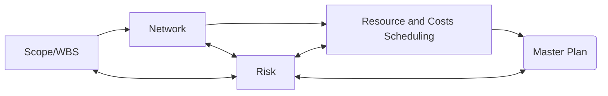

<h1>Scheduling Resources and Costs</h1>

<h2>Learning Objectives</h2>
- Identify Appropriate techniques to estimates project time and costs

---
<h2>Project Planning Process</h2>

<h2>Key Terms</h2>

**DeepSeek**
- **Heuristic**: A simple rule or trick to solve a problem quickly.  
  *Example*: Always do the hardest homework first.

- **Leveling**: Adjusting the schedule so people don’t have too much work at once.  
  *Example*: Making sure you don’t have to do homework and chores at the same time.

- **Planned Value (PV)**: The amount of work you planned to finish by a certain time.  
  *Example*: Planning to finish 3 puzzles by lunchtime.

- **Resource-Constrained Projects**: Projects where you don’t have enough people or tools to do everything at once.  
  *Example*: Only having one toy shovel to dig a big hole.

- **Resource Smoothing**: Spreading out the work so people aren’t too busy or too bored.  
  *Example*: Doing a little bit of cleaning every day instead of all at once.

- **Splitting**: Breaking a big task into smaller parts and doing them at different times.  
  *Example*: Building half of your LEGO set today and the other half tomorrow.

- **Time-Constrained Projects**: Projects that must be finished by a specific deadline.  
  *Example*: Finishing your science project before the school fair.

- **Time-Phased Budget Baseline**: A plan that shows how much money you’ll spend and when.  
  *Example*: Deciding to spend $10 on candy today and $5 on toys next week.

**Chat GPT**
- **Heuristic**: A rule of thumb or a simple way to make decisions quickly. It's like knowing to always put big puzzle pieces in the corners first.

- **Leveling**: Making sure resources (like people or tools) are evenly spread out during the project, even if it takes longer. It’s like spreading peanut butter evenly on bread so every bite tastes the same.

- **Planned Value (PV)**: How much work and money you planned to use by a certain point in the project. It’s like deciding you’ll build half the sandcastle by lunchtime.

- **Resource-Constrained Projects**: Projects where you don’t have unlimited workers or tools, so you need to plan carefully. It’s like building a treehouse with only one hammer and limited wood.

- **Resource Smoothing**: Adjusting tasks so that resources aren’t overloaded but still meeting the deadlines. It’s like making sure your friends don’t all carry too many blocks at once when building a fort.

- **Splitting**: Starting a task, pausing it, and coming back to finish it later. It’s like starting a puzzle, stopping for lunch, then coming back to finish it.

- **Time-Constrained Projects**: Projects where finishing on time is more important than anything else. It’s like getting your homework done before bedtime, no matter what.

- **Time-Phased Budget Baseline**: A detailed plan showing how much money you plan to spend at different times during the project. It’s like deciding to spend some of your allowance on candy this week and saving some for a toy next week.
