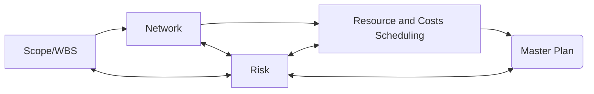

<h1>Scheduling Resources and Costs</h1>

<h2>Learning Objectives</h2>
- Identify Appropriate techniques to estimates project time and costs

---
<h2>Project Planning Process</h2>

```mermaid
flowchart LR
A[Scope/WBS] --> B[Network] --> C[Resource and Costs Scheduling]
C --> D(Master Plan)
E[Risk]
E <--> A 
B <--> E
E <--> C
E <--> D
```

