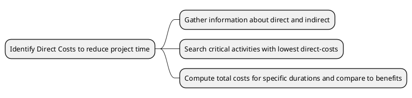

<h1>Reducing project Duration</h1>

<h2>Learning Objectives </h2>
- Perform a project to track project schedule, expenses and resources

---
<h2>Rationale for reducing project duration</h2>

- Time is money
- Unforeseen delays
- imposed deadlines and contract commitments

---
<h2> Options for accelerating project completions </h2>

- Resources not constrained
	- Adding Resources
	- Outsourcing project
	- schedule overtime
- Resource Constrained
	- Fast-tracking
	- Critical Chain
	- Reduce project scope
	- Compromise quality
---
<h2>Explanation of Project Costs</h2>

**Indirect Costs:**
- Costs that vary with time
- Supervision, Consultation, Interest
**Direct Costs:**
- Crashing activities 
- Labor, Materials, equipment, subcontractors
---
<h2>Reducing project duration</h2>

<h2>Cost Reduction graph</h2>

- Find critical path, 
- find the lowest crash price
- cut the price