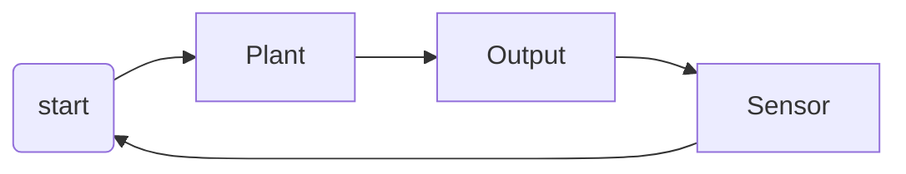

Cisco IOT resource
textbook exercise

open - predetermined input
closed 
interdependent systems

books:
https://nibmehub.com/opac-service/pdf/read/IoT%20Fundamentals.pdf

Then we can define the main characteristics of Closed-loop Control as being:

- To reduce errors by automatically adjusting the systems input.
- To improve stability of an unstable system.
- To increase or reduce the systems sensitivity.
- To enhance robustness against external disturbances to the process.
- To produce a reliable and repeatable performance.

